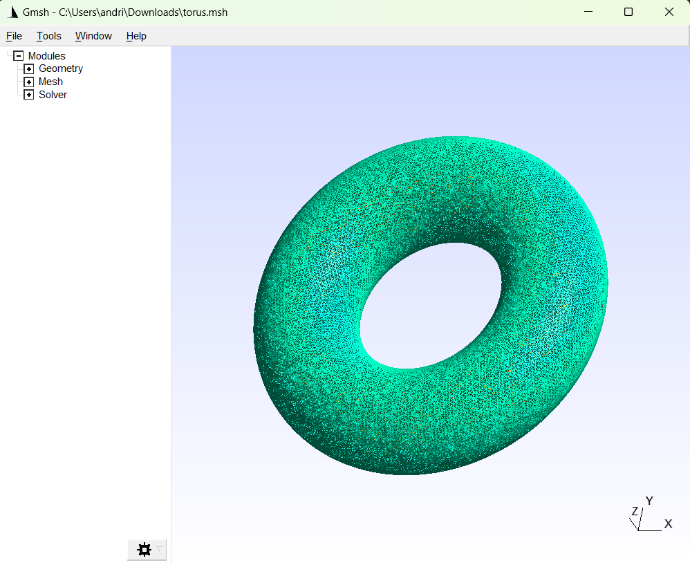

# Решение заданий первой лабораторной работы с пакетом GMSH

В данном подкаталоге содержится решение двух заданий первой лабораторной работы, использующих пакет GMSH для генерации сеток.

## Структура проекта

1. **torus.cpp** — решение первого задания. Генерирует сетку для полого тора.
2. **stl_mesher.cpp** — решение второго задания. Генерирует сетку для модели в формате STL.

## Установка зависимостей
Для того чтобы скомпилировать и запустить проект, нужно установить библиотеку `libgmsh-dev`.

```bash
sudo apt-get install libgmsh-dev
```
## Сборка проекта
Перейдите в директорию с лабораторной и выполните:

```bash
cmake -B build
cmake --build build
```

Для запуска нужного мешера выполните:
```bash
build/{name_of_file}
```

## Результаты меширования
<div style="text-align: center;">
  
  
</div>