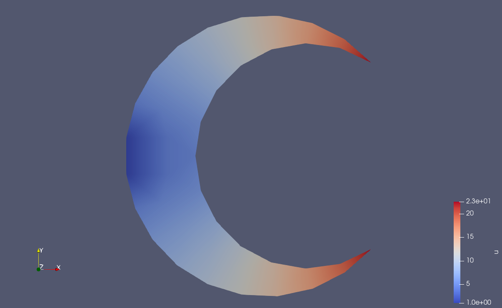

# Решение заданий третьей лабораторной работы с пакетом FEniCS

По итогу я пришёл к выводу что старый феникс лучше нового. Для запуска создайте окружение venv
```bash
python3 -m venv venv
```
в корневой директории и установите fenics и все его компоненты, включая mshr согласно инструкции 
на сайте [FEniCS](https://fenics.readthedocs.io/en/latest/installation.html). 

Для запуска выполните 
```bash
./run.sh
```

## Результаты расчёта
